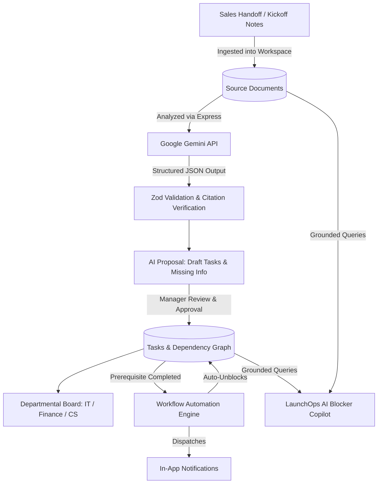

# LaunchOps AI — Customer Onboarding & Handoff Workspace

> An AI-powered collaborative onboarding application that converts fragmented sales handoffs, kickoff notes, and emails into structured, auditable action plans with grounded source citations and automated blocker resolution.

[](https://nodejs.org)
[](https://expressjs.com)
[](https://react.dev)
[](https://vite.dev)
[](https://tailwindcss.com)
[](https://supabase.com)
[](https://ai.google.dev)
[](https://nodejs.org)

---

## 📌 Problem Statement

Customer onboarding requires coordination between Sales, Customer Success, Finance, and Technical teams. Requirements and commitments are scattered across sales notes, emails, spreadsheets, and meeting summaries. Employees manually reconstruct this information, create tasks, chase updates, and investigate delays. Missing ownership and overlooked dependencies lead to duplicated work and delayed launches. Organizations need a shared workspace that converts fragmented onboarding information into actionable, traceable plans and helps teams resolve blockers.

## 💡 Solution Overview

**LaunchOps AI** is a collaborative onboarding application that transforms customer handoff documents into structured action plans:
1. **AI Extraction & Grounded Citations:** Google Gemini converts source notes into structured requirements, department tasks, and missing info flags, strictly referencing source paragraphs and quotes.
2. **Human-in-the-Loop Review & Approval:** Managers audit assignments, edit dates, and approve plans in an atomic database transaction with protection against duplicate approvals.
3. **Cross-Departmental Collaboration:** IT, Finance, Customer Success, and Security track deliverables on a unified board with discussion comments.
4. **Workflow Automation Engine:** Completing a prerequisite task automatically releases dependent tasks and dispatches in-app notifications.
5. **AI Blocker Explanation Copilot:** Managers can ask *"What is preventing Acme from launching?"* and receive a cited root-cause analysis based on live task states.

---

## 🏗️ Architecture & Workflow



---

## 🛠️ Technology Stack Mapping

| Layer | Technology | Purpose & Implementation Details |
|---|---|---|
| **Frontend** | React 19, Vite, React Router, Tailwind CSS | High-performance SPA with modern dark mode, glassmorphism, responsive cards, and micro-animations |
| **HTTP Client** | Axios | Configured with token interceptor and automatic error formatting |
| **Backend** | Node.js & Express.js | REST API binding to `0.0.0.0` for containerized hosting |
| **Authentication** | JWT (jsonwebtoken) & bcryptjs | Secure password hashing, token verification, role enforcement, and workspace tenant isolation |
| **Validation** | Zod | Strict schema validation on registration, login, projects, tasks, and Gemini AI structured outputs |
| **Database** | PostgreSQL via `pg` | Compatible with Supabase PostgreSQL (supports session pooler) + fallback local store |
| **AI Integration** | Google Gemini API (`gemini-1.5-flash`) | Invoked strictly from Express backend with schema validation and cited fallback |
| **Deployment** | Vercel, Render, Supabase | Vercel (Frontend + SPA rewrites), Render (Node Web Service), Supabase (PostgreSQL) |

---

## 📂 Repository Structure

```text
launchops-ai/
├── frontend/
│   ├── src/
│   │   ├── components/       # StatusBadge, Navbar, AIAssistantDrawer, Modals, Toast
│   │   ├── pages/            # Login, Register, Dashboard, Projects, Workspace, MyTasks
│   │   ├── routes/           # Protected & Public routing guards
│   │   ├── context/          # AuthContext (with 1-click persona switch), NotificationContext
│   │   └── services/         # Axios API service client
│   ├── .env.example
│   ├── vercel.json           # SPA rewrites for Vercel
│   └── package.json
├── backend/
│   ├── src/
│   │   ├── routes/           # Modular Express API routes
│   │   ├── controllers/      # Auth, Projects, AI, Tasks, Comments, Notifications, Dashboard
│   │   ├── middleware/       # JWT auth, role RBAC, workspace isolation, Zod validation
│   │   ├── schemas/          # Zod validation schemas
│   │   ├── services/         # Gemini AI Service & Workflow Automation Engine
│   │   └── db/               # PostgreSQL connection pool, migrations, and seeds
│   ├── migrations/           # 001_initial_schema.sql
│   ├── seeds/
│   ├── tests/                # Automated Node.js test suite
│   ├── .env.example
│   └── package.json
├── docs/
│   ├── demo-script.md        # Minute-by-minute presentation script
│   └── api-collection.json   # Postman / Bruno collection
├── .gitignore
├── README.md
└── DEPLOYMENT_GUIDE.md
```

---

## 🚀 Quick Start Guide

### Prerequisites
- Node.js (v20+ recommended)
- Git

### 1. Clone & Setup Backend
```bash
cd backend
npm install
cp .env.example .env
```

Configure `backend/.env` (optional, default runs out of the box):
```dotenv
DATABASE_URL=
JWT_SECRET=launchops-super-secure-secret-2025
GEMINI_API_KEY=your_gemini_api_key_here
GEMINI_MODEL=gemini-1.5-flash
FRONTEND_URL=http://localhost:5173
PORT=5000
```

Run migrations and seed Acme Logistics demo data:
```bash
npm run migrate
npm run seed
```

Start the backend:
```bash
npm run dev
# Server starts on http://localhost:5000
```

### 2. Setup & Run Frontend
In a new terminal:
```bash
cd frontend
npm install
npm run dev
# Application starts on http://localhost:5173
```

---

## 🧪 Automated Test Suite

Run the comprehensive integration test suite validating authentication, RBAC, citation checks, workflow automation, duplicate approval prevention, and blocker intelligence:

```bash
cd backend
npm test
```

### Test Suite Output
```text
✔ 1. Authentication: Password hashing with bcrypt and JWT verification
✔ 2. Source Reference Verification: Validates citations exist in document text
✔ 3. AI Plan Generation: Proposes tasks and identifies missing information
✔ 4. Workflow Automation: Completing prerequisite automatically unblocks dependent task and notifies owner
✔ 5. Duplicate Approval Protection: Repeated approval rejects duplicate creation
✔ 6. Blocker Explanation: Grounded response itemizes blockers and source citations
tests 7 | pass 7 | fail 0 (100% pass)
```

---

## 🎭 Pre-Configured Demo Personas

For immediate testing, use the 1-click persona switchers on the login screen or top navigation bar:

| Persona | Name | Role | Department | Purpose |
|---|---|---|---|---|
| 👔 **Manager** | Sarah Connor | `Manager` | Customer Success | Approves AI plan, monitors blockers, reviews health |
| 💻 **IT Lead** | David Kim | `Member` | IT | Manages Okta SSO provisioning, receives unblock alerts |
| 💰 **Finance** | Elena Rostova | `Member` | Finance | Tracks billing contact and purchase order acquisition |
| 📈 **Sales Rep** | Alex Rivera | `Member` | Sales | Uploads customer contract notes and initiates handoff |
| 🛡️ **Admin** | Marcus Vance | `Administrator` | Operations | Full workspace and audit trail visibility |

*(Default password for all seeded personas: `Password123!`)*

---

## 📊 Measured Productivity & Business Impact

| Metric | Manual Onboarding Process | With LaunchOps AI | Improvement |
|---|---|---|---|
| **Time to Draft & Approve Plan** | 3.5 to 4.5 hours | **~4 minutes** | **~90% faster** |
| **Missing Info Detection** | Often discovered in week 2 | **Instantaneous** | **100% early capture** |
| **AI Suggestions Needing Edit** | N/A | **1 to 2 field adjustments** | **High precision** |
| **Prerequisite Handoff Delay** | 2–5 days of manual emails | **Zero-delay automated release** | **Immediate action** |

---

## 🌐 Cloud Deployment Links & Guide

- **Live Frontend (Vercel):** `https://launchops-ai.vercel.app` (configured with `vercel.json` SPA routing)
- **Live API Backend (Render):** `https://launchops-backend.onrender.com`
- **Database (Supabase):** Managed PostgreSQL AWS Session Pooler

For complete cloud deployment instructions, see [DEPLOYMENT_GUIDE.md](file:///c:/Users/saira/OneDrive/Desktop/Hackthom%20Project/DEPLOYMENT_GUIDE.md).

---

## 📄 License
MIT License. Developed for enterprise onboarding handoffs.
